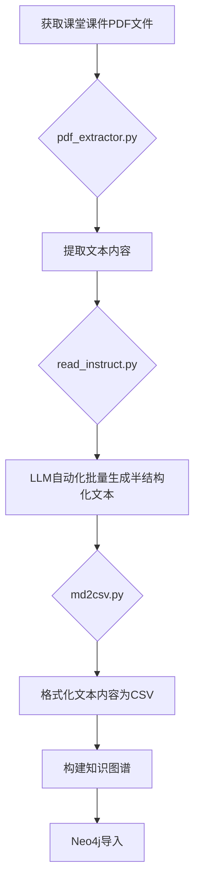
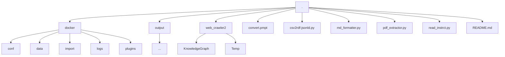
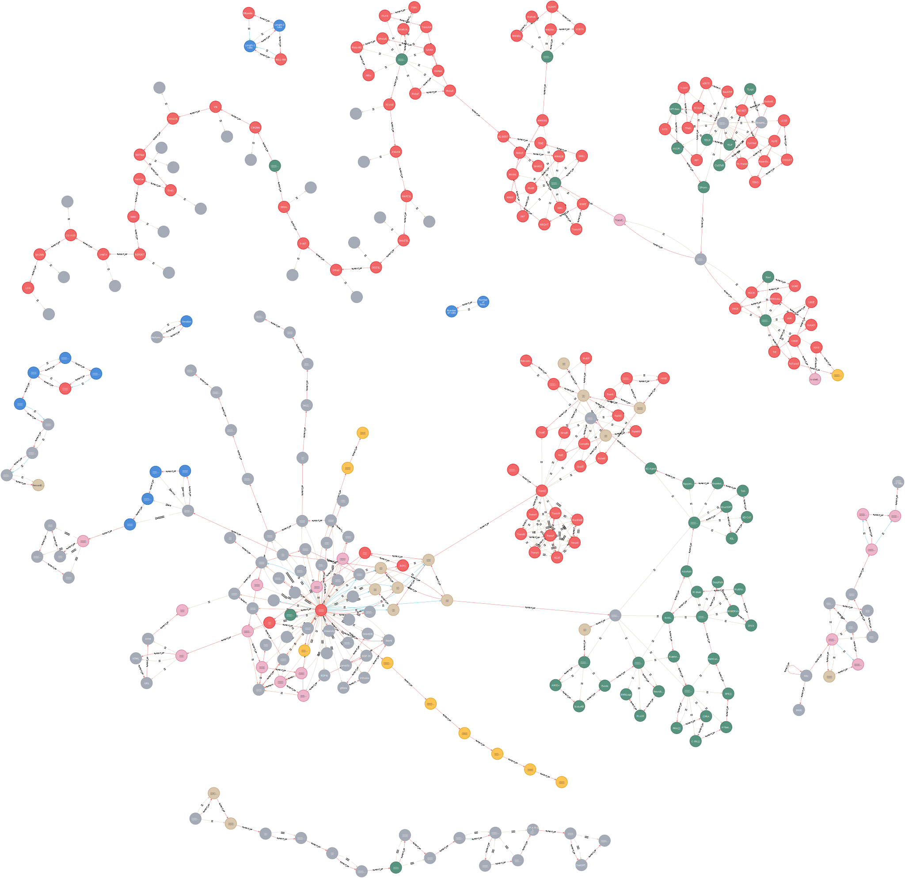

# README

## 1. 项目简介

本项目以**构建知识图谱**为目标。

大致流程如下：



大致流程如下：
1. 获取课堂课件pdf文件 > 
    ```regex
    第?\d讲?-(知识点)-2025春季\.pdf
    ```
2. 提取pdf文件中的文本内容 > `pdf_extractor.py`
3. 格式化文本内容 > `md_formatter.py` > `md2csv.py`
4. 构建知识图谱 > neo4j import

## 2. 项目环境

  - Windows 11 22H2 -> up to date
  - python 3.9.13 -> requirements.txt: [graphviz | openai | fitz | pdfplumber]
  - docker -> neo4j:52025.02.0

## 3. 项目结构



```shell
.
├─docker
│  ├─conf
│  ├─data
│  ├─import
│  ├─logs
│  └─plugins
├─output
│  └─...
├─web_crawler2
│  ├─KnowledgeGraph
│  └─Temp
├─convert.pmpt
├─csv2rdf-jsonld.py
├─md_formatter.py
├─pdf_extractor.py
├─read_instrct.py
└─README.md # 本文件
```

## 4. 项目运行
> 标记为☆的步骤为基于neo4j的操作步骤。只需构建知识图谱数据或采用其他知识图谱表示形式的，可跳过。
1. ### **☆启动docker neo4j**[^1]
    ```bash
    # docker启动neo4j
    docker run -d --name kg_container \
        -p 7474:7474 -p 7687:7687 \
        -v ./docker/data:/data \
        -v ./docker/logs:/logs \
        -v ./docker/conf:/var/lib/neo4j/conf \
        -v ./docker/import:/var/lib/neo4j/import \
        -v ./docker/plugins:/var/lib/neo4j/plugins \
        --env NEO4J_AUTH=neo4j/your_password \
        --env NEO4J_PLUGINS=apoc-extended \
        neo4j
    # 简单启动
    docker run --name neo4j-container -p 7474:7474
    ```
    ```powershell
    # or
    neo4j.bat console
    # or any other ways
    ```
2. ### **提取pdf文件中的文本内容**
    ```bash
    python pdf_extractor.py \
        -i <PATH_TO_YOUR_PDFs>/<FILE_NAME>.pdf \
        -o <PATH_TO_YOUR_OUTPUT_DIR>
    ```
    如果执行成功，你将预期在<<font color=darkred>PATH_TO_YOUR_OUTPUT_DIR</font>>下看到一个名为<<font color=darkred>FILE_NAME</font>>.txt的文件。
    + **命令行参数**
      - `-i`、`--input`：输入文件路径，必填项；也可为为目录路径，此情况下会自动提取目录下所有pdf文件。
      - `-o`、`--output`：输出文件路径，默认为`output`；不存在时会自动创建。
      - `-e`、`--engine`：提取引擎，默认为`pdfplumber`，可选值为`pdfplumber`、`pymupdf`
    
    > > &#x26a0; 注意：提取效果依赖引擎本身性能，因此可能（不如说几乎一定）存在对<u>图片</u>、<u>表格</u>、<u>公式</u>等元素的识别错误。

3. ### **通过LLM自动化批量生成半结构化文本**
    ```bash
    python read_instrct.py \
        -i <PATH_TO_YOUR_INPUT_DIR>/<FILE_NAME_1>.txt \
        -o <PATH_TO_YOUR_OUTPUT_DIR>/<FILE_NAME_2>.md
    ```
    通过LLM自动生成半结构化文本，自动从文本中归纳出节点与关系，并将其转换为markdown格式。
    + **命令行参数**
      - `-i`、`--input`：输入文件路径，必填项；同理可为目录，自动提取目录下所有txt文件。
      - `-o`、`--output`：输出文件路径，默认为`output.md`；不存在时会自动创建。
      - `-p`、`--prompt`：提示词文件路径，默认为`convert.pmpt`
      - `-m`、`--model`：模型名称，默认为`qwen-turbo`
      - `-a`、`--api-key`：API密钥，默认为环境变量`DASH_SCOPE_API_KEY`值。
        - 缺省时，会按照`OPENAI_API_KEY`(OpenAI) -> `ANTHROPIC_API_KEY`(Anthropic) -> `OPENROUTER_API_KEY`(OpenRouter) -> `DASHSCOPE_API_KEY`(DashScope/阿里云) -> `SILICONFLOW_API_KEY`(SiliconFlow/硅基流动) -> `ARK_API_KEY`(火山引擎/火山方舟) -> `AIHUBMIX_API_KEY`(AIHubMix)的顺序依次尝试获取API密钥。
        若仍失败会raise ValueError。
      - `-s`、`--split`：分割文本避免输入过长，默认为`65536`，也为max_token值

4. ### **格式化文本内容**
    ```powershell
    python md2csv.py \
        -i <PATH_TO_YOUR_INPUT_DIR>/<FILE_NAME>.md \
        -o <PATH_TO_YOUR_OUTPUT_DIR>
    ```
    将半结构化的markdown格式的文本转换为csv格式的文本。
    如果执行无误，你将预期在<<font color=darkred>PATH_TO_YOUR_OUTPUT_DIR</font>>下看到名为<<font color=darkred>FILE_NAME</font>>_concepts.csv和名为<<font color=darkred>FILE_NAME</font>>_relations.csv的文件。
    + **命令行参数**
      - `-i`、`--input`：输入文件路径，必填项；同理可为目录，自动提取目录下所有md文件。
      - `-o`、`--output`：输出文件路径，默认为`output`
    
    #### 输出csv格式介绍

    ##### > concepts.csv
    |{第1行}|:ID|name|type:LABLE|parent|_属性1:LABLE_|_属性2:LABLE_|……|
    |---|---|---|---|---|---|---|---|
    |{第2行}|id123456|知识图谱|类型|id987654|值1|值2|……|
    |{第3行}|id234567|知识表示|类型|id876543|值3|值4|……|
    |……|……|……|……|……|……|……|……|……|

    其中，
      - `:ID`为每个节点的唯一标识符。由`name`的hash截取前8位得到
      - `name`为节点的名称
      - `type`为节点的类型
      - `parent`为节点的父节点的`:ID`
      - `属性1`、`属性2`等为节点的属性。大部分为空值，仅特定节点所对应属性位有值
    
    ##### > relations.csv
    |{第1行}|:START_ID|:END_ID|:TYPE|\_o\_source\_|\_o\_target\_|属性:LABLE……|
    |---|---|---|---|---|---|---|
    |{第2行}|id123456|id234567|关系类型|节点1|节点2|……|
    |{第3行}|id234567|id345678|关系类型|节点3|节点4|……|
    |……|……|……|……|……|……|……|

    其中，
      - `:START_ID`为关系的起始节点的`:ID`
      - `:END_ID`为关系的结束节点的`:ID`
      - `type`为关系的类型
      - `_o_source_`、`_o_target_`为此关系的起始节点和结束节点的`name`
      - `属性1`、`属性2`等为关系的属性。大部分为空值，仅特定关系所对应属性位有值

5. ### **生成知识图谱Embedding**
    ```powershell
    python embedding_generator.py \
        -i <PATH_TO_YOUR_INPUT_DIR> \
        -o <PATH_TO_YOUR_OUTPUT_DIR>
    ```
    该脚本用于生成知识图谱中概念和关系的Embedding。它会加载指定目录下的所有概念和关系CSV文件，使用预训练的SentenceTransformer模型生成Embedding，并将Embedding和原始数据一同保存到输出目录。同时，原始的concepts.csv和relations.csv文件也会被复制到输出目录，以便于后续的RAG查询。
    + **命令行参数**
      - `-i`、`--input`：输入目录路径，必填项。该目录下应包含concepts.csv和relations.csv文件。
      - `-o`、`--output`：输出目录路径，默认为`embeddings_output`。生成的Embedding文件和原始CSV文件将保存到此目录。
      - `-m`、`--model_name`：用于生成Embedding的SentenceTransformer模型名称，默认为`all-MiniLM-L6-v2`。

6. ### **基于RAG的知识图谱查询**
    ```powershell
    python rag_query.py \
        -i <PATH_TO_YOUR_INPUT_DIR> \
        -q "Your query here"
    ```
    该脚本用于基于检索增强生成（RAG）对知识图谱进行查询。它会加载指定目录下的概念和关系Embedding以及原始数据，根据用户查询搜索相似的概念和关系，并结合检索到的信息生成回复。
    + **命令行参数**
      - `-i`、`--input`：输入目录路径，必填项。该目录下应包含由`embedding_generator.py`生成的Embedding文件和原始CSV文件。
      - `-q`、`--query`：用户查询语句，必填项。
      - `-k`、`--top_k`：检索最相似概念和关系的K值，默认为`5`。

7. ### **☆导入知识图谱数据**[^3]
    #### 方式1：使用neo4j自带的import工具[^2]
      ```bash
      neo4j-admin database import full \
          --nodes=concepts=<PATH_TO_YOUR_INPUT_DIR>/concepts.csv \
          --relationships=relations=<PATH_TO_YOUR_INPUT_DIR>/relations.csv \
          --overwrite-destination=true
      ```
      ```bash
      # 旧版
      neo4j-admin import \
          --database=neo4j \
          --mode=csv \
          --nodes:concepts=<PATH_TO_YOUR_INPUT_DIR>/concepts.csv \
          --nodes:relations=<PATH_TO_YOUR_INPUT_DIR>/relations.csv \
          --relationships:concepts_relations=<PATH_TO_YOUR_INPUT_DIR>/relations.csv
      ```

      * 注意事项：
        - 这样的导入方式无法自动连接父子节点关系，需要导入后按下方Cypher方法手动连接。
        - 在导入数据之前，请确保 Neo4j 数据库已停止运行。导入操作会清空目标数据库中的所有现有数据，请谨慎操作。
        - ~~&#x26a0; 笔者未实际验证，不保证正确性。~~
    #### 方式2：在neo4j中使用cypher语句
      ```cypher
      //删除所有关系与节点
      MATCH (n)-[r]-()
      DELETE r, n
      MATCH (n)
      DELETE n
      ```
      ```cypher
      //导入concepts.csv
      LOAD CSV WITH HEADERS FROM "file:///concepts.csv" AS row
      WITH row, toString(row[":ID"]) AS id
      WHERE id IS NOT NULL
      CALL apoc.create.node( // 需要安装apoc plugin
          [row.type], 
          apoc.map.merge(
              {id: id}, 
              apoc.map.fromPairs([
                  key IN [k IN keys(row) WHERE k <> ":ID"] 
                  | [CASE WHEN key ENDS WITH ":LABEL" THEN substring(key, 0, size(key) - size(":LABEL")) ELSE key END, row[key]]
              ])
          )
      ) YIELD node
      RETURN node;
      ```
      ```cypher
      //导入relations.csv
      LOAD CSV WITH HEADERS FROM "file:///relations.csv" AS row
      WITH row WHERE row[":START_ID"] IS NOT NULL AND row[":END_ID"] IS NOT NULL
      MERGE (startNode {id: toString(row[":START_ID"])})
      MERGE (endNode {id: toString(row[":END_ID"])})
      WITH startNode, endNode, row
      CALL apoc.create.relationship(
          startNode, 
          row[":TYPE"], 
          {importedAt: datetime()}, 
          endNode
      ) YIELD rel
      RETURN rel;  
      ```
      ```cypher
      // 创建父子关系
      MATCH (child)
      WHERE child.parent IS NOT NULL
      MATCH (parent {id: child.parent})
      MERGE (parent)-[:PARENT_OF]->(child)
      RETURN parent, child;
      ```
      ```cypher
      // 删除重复节点

      // 查找具有相同id的节点
      MATCH (n1)
      WHERE n1.id IS NOT NULL
      WITH n1.id AS id, collect(n1) AS nodes
      WHERE size(nodes) > 1
      // 保留第一个节点，删除其他节点
      WITH id, nodes[0] AS keepNode, nodes[1..] AS duplicateNodes
      UNWIND duplicateNodes AS dupNode
      // 将所有指向重复节点的关系重定向到保留的节点
      OPTIONAL MATCH (s)-[r]->(dupNode)
      WHERE s <> dupNode
      WITH keepNode, dupNode, s, r, type(r) AS relType, properties(r) AS relProps
      WHERE s IS NOT NULL
      CALL apoc.create.relationship(s, relType, relProps, keepNode) YIELD rel
      // 将所有从重复节点出发的关系重定向到保留的节点
      WITH keepNode, dupNode
      OPTIONAL MATCH (dupNode)-[r]->(t)
      WHERE t <> dupNode
      WITH keepNode, dupNode, t, r, type(r) AS relType, properties(r) AS relProps
      WHERE t IS NOT NULL
      CALL apoc.create.relationship(keepNode, relType, relProps, t) YIELD rel
      // 最后删除重复节点及其关系
      WITH DISTINCT keepNode, dupNode
      DETACH DELETE dupNode
      RETURN keepNode.id AS keptNodeId, count(dupNode) AS removedDuplicates;
      ```
      ```cypher
      // 查找并移除重复关系
      MATCH (a)-[r]->(b)
      WITH a, b, type(r) AS relType, collect(r) AS rels
      WHERE size(rels) > 1
      // 保留第一个关系，删除其他重复关系
      WITH a, b, relType, rels[0] AS keepRel, rels[1..] AS duplicateRels
      UNWIND duplicateRels AS dupRel
      DELETE dupRel
      RETURN a.id AS sourceId, b.id AS targetId, relType, count(dupRel) AS removedDuplicates;
      ```
6. ### **☆使用neo4j可视化知识图谱**
    浏览器打开[neo4j页面](http://localhost:7474)，查看图片！
    大功告成！
    
    * ~当然，具体效果依使用材料、大模型选择和随机生成结果变化，不保证实际产生结果相同~
    ---

7. ### _其他知识图谱形式兼容尝试_
    ```bash
    python csv2rdf-jsonld.py \
        -i <PATH_TO_YOUR_INPUT_DIR> \
        -o <PATH_TO_YOUR_OUTPUT_DIR>
    ```
    ```bash
    python csv2owl.py \
        -ic input_concepts.csv \
        -ir input_relations.csv \
        -o output.owl
    python csv2ttl.py \
        -ic input_concepts.csv \
        -ir input_relations.csv \
        -o output.ttl
    ```
    将csv格式的文本转换为jsonld、owl、ttl格式的文本。适配[Protege](https://protege.stanford.edu/)
    * &#x26a0; ~未经详尽测试，不保证效果~
    ---

## 5. TODO
- [x] 完成基本功能
- [x] 完成文档
- [ ] 完成实验报告
- [ ] 完成ppt


  ---

    真todo：
    - [x] 完成jsonld代码、介绍
      - 或者owl？ 
        - -> 至少指定Ontologyrdf、owl:Class声明、rdfs:label赋予、rdfs:subClassOf继承、rdfs:Comment
        - ttl完成关系建模
    - [x] 改md2csv的bug
    - [x] 改善pmpt，给出类型规范
    - [ ] 实际测试csv2owl, csv2ttl
    - [ ] 实际扔到neo4j里试试：两种方法都要
    - [x] 截图扔文档里
    - [ ] 知识融合
    - [ ] 知识推理
    - [ ] WebCrawler融合+文档
    - [ ] RAG查询
    - [ ] Gradio前端
    - [ ] arXiv爬取
    - [ ] NetworksX

[^1]: [docker 安装部署Neo4j](https://www.cnblogs.com/caoyusang/p/13610408.html)
[^2]: [Neo4j-Admin Import](https://neo4j.com/docs/operations-manual/current/tutorial/neo4j-admin-import/)
[^3]: [Neo4j CSV Import](https://neo4j.com/docs/getting-started/data-import/csv-import/)