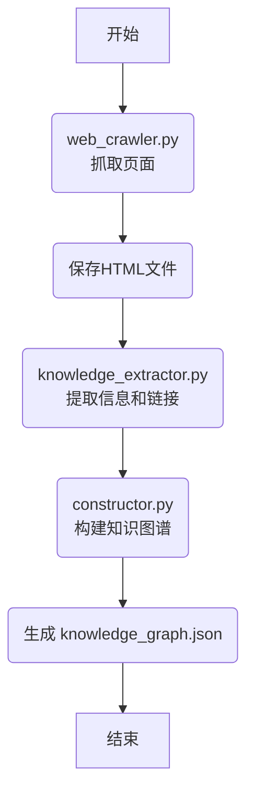

# 百度百科知识图谱抽取工具

本项目包含用于从百度百科页面抽取知识并构建知识图谱的脚本。

## 文件说明

- [web_crawler.py](./web_crawler.py)</mcfile>: 负责网页的抓取和HTML内容的保存。
- [knowledge_extractor.py](./knowledge_extractor.py): 从抓取的HTML文件中提取结构化信息，包括页面标题、摘要、基本信息、目录、正文以及页面内的超链接。
- [constructor.py](./constructor.py): 利用提取的知识和超链接关系构建知识图谱，处理节点间的父子关系（`parents` 和 `children` 字段）。
- [knowledgegraph.json](./KnowledgeGraph/knowledge_graph.json): 存储最终构建的知识图谱数据。

## 工作流程

整个知识图谱的构建过程如下：

1.  使用 <mcfile name="web_crawler.py" path="d:\Documents\Coding\KnowledgeGraph\web_crawler2\web_crawler.py"></mcfile> 抓取指定的百度百科页面，并将HTML内容保存到本地文件。
2.  使用 <mcfile name="knowledge_extractor.py" path="d:\Documents\Coding\KnowledgeGraph\web_crawler2\knowledge_extractor.py"></mcfile> 从保存的HTML文件中提取页面的关键信息和内部超链接。
3.  使用 <mcfile name="constructor.py" path="d:\Documents\Coding\KnowledgeGraph\web_crawler2\constructor.py"></mcfile> 处理提取的信息和链接，构建知识图谱的节点和边，特别是根据超链接关系建立父子节点（`parents` 和 `children`）连接。
4.  最终生成的知识图谱数据保存在 <mcfile name="KnowledgeGraph\knowledge_graph.json" path="d:\Documents\Coding\KnowledgeGraph\web_crawler2\KnowledgeGraph\knowledge_graph.json"></mcfile> 文件中。

## 使用方法

通常，您只需要运行 `constructor.py` 脚本来启动整个流程（它会调用其他模块）。

```bash
python constructor.py
```

请根据需要在 `constructor.py` 中配置起始URL和爬取深度等参数。

## 效果

生成的知识图谱文件：[knowledge_graph.json](KnowledgeGraph\knowledge_graph.json)

## 流程图



        